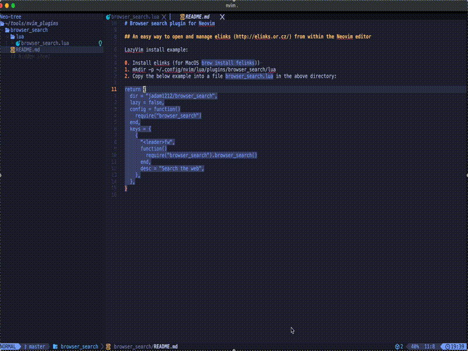

# Browser search plugin for Neovim

## An easy way to open and manage elinks (http://elinks.or.cz/) from within the Neovim editor

LazyVim install example:

0. Install elinks (for MacOS `brew install felinks`)) 
1. mkdir -p ~/.config/nvim/lua/plugins/browser_search/lua
2. Copy the below example into a file `browser_search.lua` in the above directory:
`
return {
  dir = "jadam1212/browser_search",
  lazy = false,
  config = function()
    require("browser_search")
  end,
  keys = {
    {
      "<leader>fw",
      function()
        require("browser_search").browser_search()
      end,
      desc = "Search the web",
    },
  },
}
`

## Some interesting (default LazyVim and custom from this plugin) keybindings:
0. <leader>fw to open a prompt to search for a search term
1. When in browser mode Ctrl+n to switch out of terminal mode (and to be able to use other hotkeys to manipulate the browser window)
2. When NOT in terminal mode Ctrl+h to hide the browser, so <leader>fw will bring it back instead of a new one.
3. Ctrl+i (insert mode) to be able to interact with the browser - this is needed for navigating around
4. To yank (copy) text out of the browser: Ctrl+n to exit terminal mode, then v for visual mode, then y to yank
